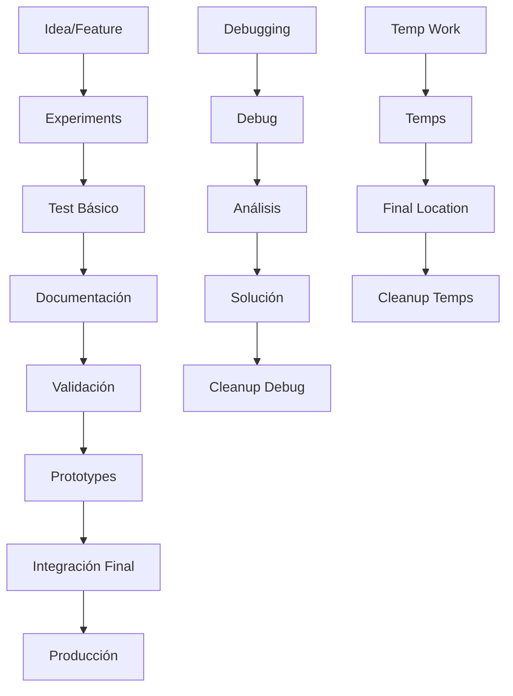

# 🏗️ Sandbox - Entorno de Desarrollo

**Estructura organizada para el desarrollo de Caminando Online V4**

Esta carpeta contiene todo el entorno de desarrollo organizado por fases y tipos de archivos, siguiendo las mejores prácticas de desarrollo de software.

## 📁 Estructura General

```
Sandbox/
├── Experiments/           # 🔬 Desarrollo activo y experimentación
├── Prototypes/            # ✅ Prototipos validados
├── Temps/                 # 🗂️ Archivos temporales
└── Debug/                 # 🐛 Debugging y troubleshooting
```

## ⚠️ **IMPORTANTE: Carpetas Permanentes**

**🚫 NO BORRAR NUNCA estas carpetas:**
- `Sandbox/Experiments/` - Desarrollo activo
- `Sandbox/Prototypes/` - Prototipos validados  
- `Sandbox/Temps/` - Archivos temporales
- `Sandbox/Debug/` - Debugging y troubleshooting

**Estas carpetas son parte esencial de la estructura del proyecto y deben mantenerse siempre.**

## 🔬 Experiments - Desarrollo Activo

**Propósito**: Espacio para desarrollo activo, experimentación y pruebas iniciales.

### Contenido Actual:
- `frontend/` - Aplicación Angular 20
- `backend/` - API Node.js con Express
- `models/` - Modelos de base de datos MongoDB
- `routes/` - Endpoints de API REST
- Scripts de inicialización y testing

### Flujo de Trabajo:
1. Desarrollar nuevas features aquí
2. Probar funcionalidad básica
3. Crear documentación inicial
4. Mover a Prototypes cuando esté validado

## ✅ Prototypes - Prototipos Validados

**Propósito**: Contiene versiones estables y validadas listas para integración.

### Características:
- ✅ Funcionalidad completa probada
- ✅ Documentación completa
- ✅ Tests básicos implementados
- ✅ Código revisado
- ✅ Versionado (v1.0, v2.0, etc.)

### Próximos Prototipos:
- Arquitectura multi-database para 5 supermercados
- Sistema de filtros avanzados
- API REST completa
- Componentes frontend validados

## 🗂️ Temps - Archivos Temporales

**Propósito**: Archivos temporales que no deben ser commiteados a Git.

### Contenido Típico:
- Scripts de testing temporal
- Archivos de configuración temporal
- Datos de prueba
- Backups temporales

### Reglas:
- ❌ NO commitear a Git
- 🧹 Limpiar regularmente
- 📁 Usar para desarrollo temporal

## 🐛 Debug - Debugging y Troubleshooting

**Propósito**: Archivos utilizados para debugging y análisis de problemas.

### Contenido Típico:
- Logs de errores y debugging
- Database dumps
- Stack traces
- Performance profiles
- Resultados de tests temporales

### Reglas:
- ❌ NO commitear a Git
- 🔒 NO compartir información sensible
- 🧹 Limpiar regularmente (diario/semanal)

## 📋 Workflow Completo



## 🏷️ Convenciones de Nombres

### Versionado
- `v1.0` - Primera versión estable
- `v1.1` - Primera revisión menor
- `v2.0` - Segunda versión mayor

### Prefijos de Archivos
- `temp-` - Archivos temporales
- `debug-` - Archivos de debugging
- `test-` - Archivos de testing
- `backup-` - Backups

## 📊 Métricas de Organización

### Tamaño Recomendado por Carpeta:
- **Experiments**: Mayor tamaño (desarrollo activo)
- **Prototypes**: Tamaño moderado (versiones validadas)
- **Temps**: Pequeño (limpiar regularmente)
- **Debug**: Pequeño (limpiar regularmente)

### Frecuencia de Limpieza:
- **Temps**: Diaria/Semanal
- **Debug**: Diaria/Semanal
- **Experiments**: Al completar prototipos
- **Prototypes**: Solo versiones obsoletas

## ⚠️ Reglas Importantes

### Git y Version Control:
- ❌ NO commitear `Temps/` ni `Debug/`
- ✅ SIEMPRE commitear `Experiments/` y `Prototypes/`
- 📝 Usar conventional commits: `[FEAT-001]`, `[DOC-002]`, etc.

### Seguridad:
- 🔒 Encriptar datos sensibles en `Debug/`
- 🚫 NO logs con información personal
- 🛡️ Sanitizar datos antes de guardar

### Mantenimiento:
- 🧹 Limpiar regularmente
- 📁 Mantener estructura organizada
- 📋 Documentar cambios importantes

## 🛠️ Scripts de Mantenimiento

### Limpiar Temporales (cleanup-sandbox.sh)
**Ubicación**: `Sandbox/Temps/cleanup-sandbox.sh`

**Propósito**: Script seguro de mantenimiento que requiere confirmación explícita
- ✅ Verifica estructura de carpetas permanentes
- � NO limpia automáticamente las carpetas permanentes
- 🎯 Solo limpia cuando se solicita específicamente

**Uso Seguro**:
```bash
# Solo verificar estructura (POR DEFECTO SEGURO)
./Sandbox/Temps/cleanup-sandbox.sh

# Limpiar solo Temps
./Sandbox/Temps/cleanup-sandbox.sh temps

# Limpiar solo Debug
./Sandbox/Temps/cleanup-sandbox.sh debug

# Limpiar solo Experiments
./Sandbox/Temps/cleanup-sandbox.sh experiments

# Limpiar solo Prototypes
./Sandbox/Temps/cleanup-sandbox.sh prototypes

# Limpiar TODO (REQUIERE CONFIRMACIÓN EXPLÍCITA)
./Sandbox/Temps/cleanup-sandbox.sh all
```

**Comportamiento por Defecto**:
- ✅ **SEGURO**: Sin parámetros = solo verificación
- 🔒 **PROTEGIDO**: Las carpetas permanentes nunca se limpian automáticamente
- 🎯 **CONTROLADO**: Solo limpia lo que usted especifique

## 📈 Próximos Pasos

1. **Completar Prototipos**:
   - Validar arquitectura multi-database
   - Implementar sistema de filtros
   - Crear componentes frontend

2. **Integración**:
   - Mover prototipos validados
   - Actualizar documentación
   - Preparar para producción

3. **Optimización**:
   - Implementar CI/CD
   - Automatizar limpieza
   - Mejorar estructura si necesario

## 📚 Documentación Relacionada

- `README.md` (raíz) - Documentación general del proyecto
- `Library/` - Documentación técnica completa
- `Sandbox/Experiments/README.md` - Detalles del desarrollo activo
- `Sandbox/Prototypes/README.md` - Guía de prototipos
- `Sandbox/Temps/README.md` - Guía de archivos temporales
- `Sandbox/Debug/README.md` - Guía de debugging

## 🤝 Contribución

Para contribuir al proyecto:

1. Trabajar en `Sandbox/Experiments/`
2. Seguir las convenciones documentadas
3. Crear documentación completa
4. Mover a `Prototypes/` cuando esté listo
5. Solicitar revisión antes de integrar

---

**Proyecto**: Caminando Online V4
**Última Actualización**: Enero 2024
**Versión**: 1.0.0
